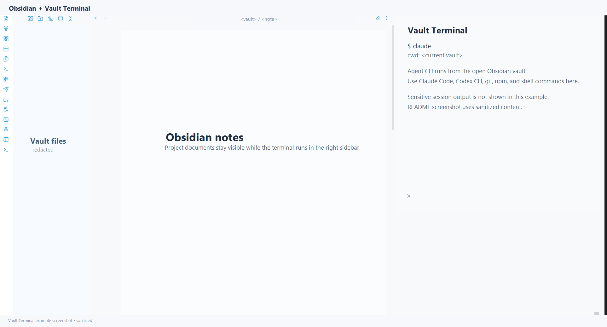

# Vault Terminal

Obsidian 데스크톱 앱의 우측 사이드바에 현재 볼트 경로를 작업 디렉터리로 사용하는 실제 터미널을 여는 플러그인입니다.

> 상태: 초기 데스크톱 베타입니다. Windows와 macOS 릴리스 패키지를 배포하며, Community Plugin Directory 등록을 준비 중입니다. Linux는 소스 설치 경로를 유지합니다.

> Community Plugin Directory에는 아직 등록하지 않았습니다. 표준 플러그인 파일은 `manifest.json`, `main.js`, `styles.css`만 사용하고, native `node-pty` 런타임은 첫 실행 또는 설정 화면에서 GitHub Release의 OS/아키텍처별 런타임 ZIP을 내려받아 설치하는 구조로 준비했습니다.

## English Overview

Vault Terminal opens a real terminal in Obsidian's right sidebar and starts it from the current vault path. It is designed for workflows where Obsidian holds project notes while Claude Code, Codex CLI, git, npm, and other local CLI tools run against the same vault.

Current distribution is GitHub Release ZIP based while Community Plugin Directory registration is being prepared. The plugin is desktop-only and requires Node.js plus a native PTY runtime. Standard Community Plugin installs can download the verified OS-specific runtime from the matching GitHub Release.

## 주요 기능

- Vault Terminal 탭을 열면 터미널이 자동으로 시작됩니다.
- 현재 Obsidian 볼트가 셸의 작업 디렉터리가 됩니다.
- PowerShell, zsh, bash 같은 일반 셸 명령을 탭 안에서 실행합니다.
- Claude Code, Codex CLI, Git, Python, npm 같은 CLI 도구를 볼트 기준으로 실행합니다.
- 터미널 텍스트 선택과 복사를 지원합니다.
- 파일을 터미널에 드롭하면 agent CLI용 파일 참조를 입력합니다.
- 클립보드 이미지를 볼트에 저장하고 `@path` 참조를 입력합니다.
- Claude Code 멀티라인 입력을 위해 `Shift + Enter`를 기본적으로 Claude의 `\` + Return 줄바꿈 경로로 보냅니다.
- 한글 IME 조합 중 마지막 글자가 다음 줄로 밀리지 않도록 짧은 지연 후 줄바꿈을 보냅니다.
- Obsidian 테마를 기본으로 따르되 Codex/Claude Code ANSI 색상이 읽히도록 터미널 팔레트를 보정합니다.
- 긴 scrollback과 `Shift + Wheel`, `Ctrl + Shift + PageUp/PageDown` 강제 스크롤을 지원합니다.
- TLS inspection proxy 또는 사용자 지정 인증서 환경을 위해 Node TLS/CA 설정을 선택적으로 주입할 수 있습니다.
- Community Plugin 표준 설치처럼 `manifest.json`, `main.js`, `styles.css`만 설치된 경우에도 런타임 파일을 자동 설치할 수 있습니다.

## 사용 예시



Vault Terminal은 Obsidian 문서를 보면서 같은 볼트 경로에서 agent CLI를 실행하는 흐름에 맞춰 만들었습니다.

예를 들어 중앙에는 프로젝트 인덱스나 작업 노트를 열어두고, 우측 사이드바에서는 Vault Terminal로 `claude`, `codex`, `git`, `npm` 같은 명령을 실행할 수 있습니다. 터미널의 작업 디렉터리는 현재 볼트이므로 Claude Code나 Codex CLI가 `AGENTS.md`, `CLAUDE.md`, 프로젝트 노트, 소스 파일을 같은 기준 경로에서 읽고 작업합니다.

이 플러그인은 실제 로컬 셸을 띄웁니다. 따라서 터미널에서 실행한 CLI의 파일 접근, 네트워크 접근, 인증서 설정은 사용자의 PC와 해당 CLI 설정을 그대로 따릅니다.

## 릴리스 다운로드

GitHub Actions가 태그 릴리스마다 OS별 ZIP을 자동 생성합니다.

| 파일 | 대상 |
| --- | --- |
| `manifest.json`, `main.js`, `styles.css` | Community Plugin Directory / BRAT용 표준 플러그인 파일 |
| `runtime-manifest.json` | 플러그인이 런타임 ZIP을 검증하기 위한 SHA-256 매니페스트 |
| `VaultTerminal-<version>-windows-x64.zip` | Windows x64 |
| `VaultTerminal-<version>-macos-x64.zip` | macOS Intel |
| `VaultTerminal-<version>-macos-arm64.zip` | macOS Apple Silicon |
| `VaultTerminal-runtime-<version>-windows-x64.zip` | Windows x64 런타임 전용 |
| `VaultTerminal-runtime-<version>-macos-x64.zip` | macOS Intel 런타임 전용 |
| `VaultTerminal-runtime-<version>-macos-arm64.zip` | macOS Apple Silicon 런타임 전용 |

릴리스 페이지:

```text
https://github.com/obst2580/obsidian-powershell/releases
```

Windows 인증서 설정 스크립트도 릴리스 asset으로 함께 올라갑니다.

```text
configure-corporate-ca.ps1
configure-corporate-ca.cmd
```

## 설치

설치 전 요구사항:

- Obsidian Desktop 앱이 필요합니다.
- Node.js가 시스템에 설치되어 있어야 합니다. 릴리스 패키지는 Node.js 22 기준으로 빌드합니다.
- VS Code extension이 내부적으로 사용하는 Node.js는 Obsidian에서 보이지 않습니다. `node --version`이 일반 PowerShell, Terminal, zsh, bash에서 실행되는지 확인하세요.
- Claude Code, Codex CLI 같은 agent CLI는 사용자 PC에 별도로 설치되어 있어야 합니다. VS Code extension만 설치된 상태와 터미널 명령 `claude`, `codex`가 실행되는 상태는 다릅니다.

### GitHub Release 전체 ZIP 설치

플러그인은 볼트마다 설치됩니다. OS/아키텍처에 맞는 전체 ZIP을 아래 경로에 압축 해제합니다.

```text
<볼트경로>/.obsidian/plugins/vault-terminal/
```

압축 해제 후 플러그인 폴더에는 다음 파일과 폴더가 있어야 합니다.

```text
manifest.json
main.js
styles.css
pty-host.js
node_modules/
```

Obsidian을 재시작한 뒤 아래 메뉴에서 플러그인을 활성화합니다.

```text
Settings > Community plugins > Vault Terminal > Enable
```

업데이트할 때도 같은 위치에 새 ZIP을 덮어쓴 뒤 Obsidian을 재시작하거나 플러그인을 껐다 켭니다.

### Community Plugin / BRAT 설치

Community Plugin Directory 등록 후에는 Obsidian에서 일반 플러그인처럼 설치할 수 있습니다. BRAT으로 테스트 설치하는 경우에도 표준 플러그인 파일만 먼저 설치됩니다.

표준 설치 직후 플러그인 폴더에는 보통 아래 세 파일만 있습니다.

```text
manifest.json
main.js
styles.css
```

Vault Terminal 탭을 열면 런타임 파일이 없다는 안내가 표시됩니다. **Install runtime**을 누르면 플러그인이 현재 버전의 GitHub Release에서 `runtime-manifest.json`을 읽고, OS/아키텍처에 맞는 런타임 ZIP을 내려받아 SHA-256 검증 후 플러그인 폴더에 압축 해제합니다.

설정에서도 같은 작업을 실행할 수 있습니다.

```text
Settings > Vault Terminal > Runtime files > Install runtime
```

터미널에 `Node.js was not found` 또는 `spawn node ENOENT`가 표시되면 Node.js를 시스템에 설치한 뒤 Obsidian을 재시작하세요. Node를 별도 위치에 설치했다면 `Settings > Vault Terminal > Node executable`에 절대경로를 입력할 수 있습니다.

## 개발

```powershell
npm install
npm run build
```

Windows 볼트에 설치:

```powershell
.\install.ps1 -VaultPath "C:\path\to\vault"
```

macOS/Linux 볼트에 설치:

```bash
npm install
npm run build
./install.sh /path/to/vault
```

로컬 릴리스 ZIP 생성:

```powershell
pwsh -NoProfile -File .\scripts\package-release.ps1 -Platform windows -Arch x64 -OutputDir dist
```

## GitHub Actions 릴리스

태그를 푸시하면 `.github/workflows/release.yml`이 실행됩니다.

```powershell
git tag <version>
git push origin <version>
```

Obsidian Community Plugin Directory 검증을 통과하려면 GitHub release tag가 `manifest.json`의 `version`과 정확히 같아야 합니다. 예를 들어 `manifest.json`이 `0.3.2`이면 tag도 `0.3.2`이어야 하며, `v0.3.2`처럼 `v`를 붙이지 않습니다.

워크플로는 다음 작업을 수행합니다.

- `npm ci`
- `npm run build`
- OS별 ZIP 패키징
- 런타임 전용 ZIP 패키징
- `runtime-manifest.json` 생성
- GitHub Release 생성 또는 기존 Release asset 갱신

사용하는 GitHub-hosted runner:

- `windows-latest`: Windows x64 패키지
- `macos-15-intel`: macOS Intel x64 패키지
- `macos-14`: macOS Apple Silicon arm64 패키지

macOS runner 라벨은 GitHub 공식 hosted runner 문서를 기준으로 선택했습니다.

## 런타임 파일

이 플러그인은 터미널 UI에 `xterm`, 실제 pseudo-terminal에 `node-pty` 런타임을 사용합니다.

`pty-host.js`는 Obsidian renderer 프로세스 안에서 native PTY를 직접 로드하지 않도록 별도 Node 프로세스로 실행됩니다.

기본 셸 선택:

- Windows: PowerShell 7이 있으면 PowerShell 7, 없으면 Windows PowerShell
- macOS: Homebrew `pwsh`가 있으면 `pwsh`, 없으면 사용자 `$SHELL`, 그 다음 `zsh`/`bash`
- Linux: `pwsh`가 있으면 `pwsh`, 없으면 사용자 `$SHELL`, 그 다음 `bash`/`sh`

native PTY 런타임이 필요하므로 전체 릴리스 ZIP과 런타임 전용 ZIP은 OS/아키텍처별로 분리됩니다. Community Plugin 표준 설치에서는 런타임 전용 ZIP을 현재 플러그인 버전과 같은 GitHub Release에서 내려받고 SHA-256으로 검증합니다.

## 파일과 이미지 참조

- 파일을 터미널에 드롭하면 파일 참조가 입력됩니다.
- 현재 볼트 안의 파일은 `@relative/path` 형식으로 입력됩니다.
- 볼트 밖의 파일은 quoted absolute path로 입력됩니다.
- 이미지나 스크린샷을 클립보드에 복사한 뒤 터미널에서 `Ctrl+V`를 누르면, 이미지를 볼트에 저장하고 `@path`를 입력합니다.
- 명령 팔레트의 **Insert current note reference in Vault Terminal** 명령으로 현재 노트를 `@note.md` 형식으로 입력할 수 있습니다.

클립보드 이미지는 기본적으로 아래 폴더에 저장됩니다.

```text
Vault Terminal Attachments/
```

설정에서 변경할 수 있습니다.

```text
Settings > Vault Terminal > Attachment folder
```

## Windows PTY

Windows 기본 PTY backend는 `winpty`입니다.

ConPTY는 일부 raw keyboard/paste escape sequence를 Node 기반 CLI가 읽기 전에 필터링할 수 있습니다. Claude Code/Codex 같은 agent CLI의 특수 입력을 안정적으로 전달하기 위해 Windows 기본값은 `winpty`입니다.

환경에 따라 ConPTY가 더 잘 맞으면 플러그인 설정에서 바꿀 수 있습니다.

```text
Settings > Vault Terminal > Windows PTY backend
```

## Shift + Enter

기본값은 **Claude backslash newline**입니다.

Claude Code는 줄 끝의 `\` + Return을 멀티라인 줄바꿈으로 처리합니다. Vault Terminal은 `Shift + Enter`를 이 경로로 보내며, 한글 IME 마지막 글자가 먼저 커밋되도록 짧게 지연합니다.

다른 도구를 위해 아래 모드도 남겨두었습니다.

- `Claude backslash newline`
- `Bracketed newline paste`
- `xterm paste newline`
- `Modified Enter`
- `CSI-u Shift Enter`
- `Line feed`

설정 위치:

```text
Settings > Vault Terminal > Shift+Enter behavior
```

## 화면 색상과 스크롤

기본 색상은 **Follow Obsidian**입니다. Obsidian의 라이트/다크 테마를 따르되, 터미널 ANSI 색상은 읽기 쉬운 팔레트로 보정합니다.

스크롤 관련 동작:

- 일반 출력은 50,000줄 scrollback을 유지합니다.
- CLI가 마우스 입력을 잡고 있으면 `Shift + mouse wheel`로 터미널 scrollback을 강제 스크롤합니다.
- `Ctrl + Shift + PageUp/PageDown`으로 페이지 단위 이동을 할 수 있습니다.
- fullscreen TUI 도구는 alternate screen buffer를 사용할 수 있습니다. 이 경우 오래된 출력은 일반 scrollback이 아니라 CLI 내부 화면에 있을 수 있습니다.

## SSL / 인증서 설정

기본 설치 상태에서는 Node TLS 또는 인증서 동작을 바꾸지 않고, 인증서 파일을 포함하지 않습니다.

TLS inspection proxy 또는 사용자 지정 CA가 필요한 네트워크에서 Claude Code 같은 Node 기반 CLI가 아래 오류를 내면 인증서 설정이 필요할 수 있습니다.

```text
Self-signed certificate detected
Unable to connect to API
```

플러그인 설정:

- **Use system certificate store**: Node의 system CA store 사용
- **Extra CA certificate**: PEM 인증서 파일 경로. 상대 경로는 플러그인 폴더 기준입니다.

Windows에서 루트 인증서를 내보내고 설정하려면 릴리스의 스크립트를 사용합니다.

```powershell
.\configure-corporate-ca.ps1 -VaultPath "C:\path\to\vault" -Thumbprint "<root-ca-thumbprint>"
```

PEM 파일을 직접 받은 경우:

```powershell
.\configure-corporate-ca.ps1 -VaultPath "C:\path\to\vault" -PemPath "C:\path\to\custom-ca.pem"
```

브라우저는 `.ps1`을 자동 실행하지 않습니다. PowerShell에서 직접 실행하거나, 같은 폴더에 있는 `configure-corporate-ca.cmd`를 실행합니다.

## 배포 메모

Obsidian Community Plugin 표준 설치는 보통 `manifest.json`, `main.js`, `styles.css`만 다룹니다. 이 플러그인은 실제 터미널을 위해 `pty-host.js`와 native `node-pty` 런타임도 필요합니다.

따라서 릴리스에는 두 종류의 asset을 함께 올립니다.

- 수동 설치용 전체 ZIP: 표준 플러그인 파일 + `pty-host.js` + native 런타임 포함
- Community Plugin용 런타임 ZIP: 표준 플러그인 설치 후 플러그인이 직접 내려받아 설치

런타임 자동 설치는 같은 버전의 GitHub Release에서만 받도록 제한하고, `runtime-manifest.json`의 크기와 SHA-256 값이 맞지 않으면 설치하지 않습니다.

## 보안과 권한

Vault Terminal은 데스크톱 전용 플러그인이며, 실제 로컬 셸과 별도 Node.js PTY host 프로세스를 실행합니다.

- 터미널에서 실행한 명령은 사용자 PC 권한으로 동작합니다.
- 명령은 볼트 안팎의 로컬 파일, 네트워크, 인증 정보에 접근할 수 있습니다. 접근 범위는 실행한 CLI와 운영체제 권한을 따릅니다.
- Claude Code, Codex CLI, git, npm 같은 외부 CLI는 별도로 설치해야 합니다.
- native `node-pty` 런타임은 전체 ZIP에 포함되거나, Community Plugin 표준 설치 후 GitHub Release에서 내려받아 SHA-256 검증 후 설치됩니다.
- TLS/CA 환경변수는 사용자가 설정에서 명시적으로 켠 경우에만 주입합니다.
- 이 플러그인은 자체 telemetry, analytics, 광고 코드를 포함하지 않습니다.

## 라이선스

MIT
