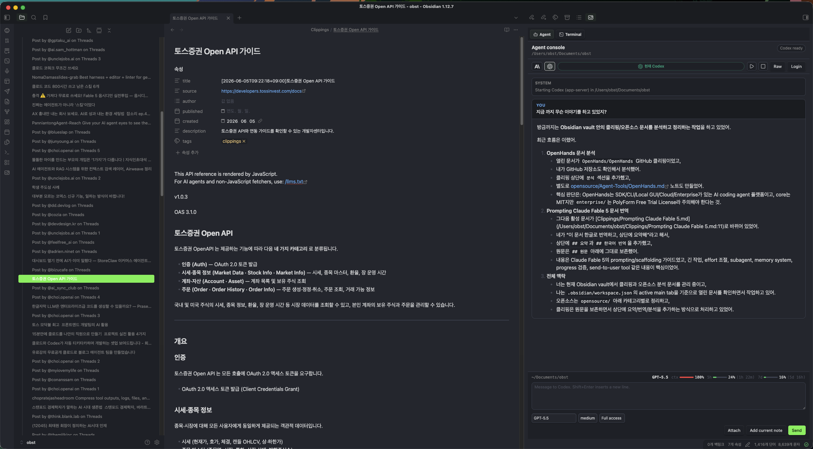

# Obst Terminal

Obsidian 데스크톱 우측 사이드바에서 현재 볼트 경로를 작업 디렉터리로 쓰는 **Agent Console + Raw terminal** 플러그인입니다. 이 저장소의 현재 버전은 `0.6.19`입니다.

[English README](README.md)

> 데스크톱 전용 플러그인입니다. Claude Code, Codex CLI, Node.js, Git, npm 같은 외부 도구는 포함하지 않습니다. 사용자의 PC에 설치되어 있고 일반 터미널에서 실행되어야 합니다.



## 현재 동작 기준

Obst Terminal을 열면 기본 화면은 **Agent Console**입니다. 상단에서 `Claude`와 `Codex`를 선택할 수 있고, 현재 선택된 provider는 `현재 Claude Code` 또는 `현재 Codex` chip으로 표시됩니다. Claude와 Codex transcript는 서로 섞이지 않고 따로 유지됩니다.

한 볼트 안에서 여러 AI 세션을 나눠 사용할 수 있습니다. 기존 `Open terminal` 명령은 첫 Obst Terminal 뷰를 재사용하고, `Open new AI session` 명령이나 Agent Console의 `+` 버튼은 Obsidian 탭을 새로 만들지 않고 플러그인 내부 상단에 AI 세션 탭을 추가합니다. 각 탭은 독립 Claude sessionId / Codex threadId, 선택 provider, 수정 가능한 제목, 표시 중인 transcript, 실행 중인 backend/PTY 상태를 유지합니다. 탭을 바꿔도 실행 중인 에이전트는 정지되지 않고 자기 세션 transcript에 계속 기록됩니다. 이 구조는 PM, Writer, Reviewer처럼 역할이 다른 여러 AI를 같은 프로젝트 문서 옆에 나눠두는 용도입니다.

### Codex

Codex Agent Console은 기본적으로 fullscreen TUI가 아니라 `codex app-server`를 실행합니다.

- `codex app-server`와 JSON-RPC로 통신합니다.
- ChatGPT 로그인 상태를 확인하고, 필요하면 브라우저 로그인 또는 device code 로그인을 시작합니다.
- 모델, reasoning effort, access level을 Agent Console 안에서 선택합니다.
- 한 user turn의 reasoning, command 실행, tool 호출, 최종 답변을 하나의 transcript 카드 안에 표시합니다.
- 응답 중에는 `Send` 버튼이 `Stop` 역할을 하며 현재 turn을 interrupt합니다.
- 응답 중 새 메시지를 보내면 Codex app처럼 queue에 넣습니다.
- statusline에는 현재 볼트 경로, git branch, 선택 모델, context 사용률, 5시간/7일 rate-limit meter를 표시합니다.
- streaming delta는 일정 간격으로 모아 렌더링해서 Obsidian UI가 멈추는 현상을 줄입니다.

Agent Console의 fallback PTY 경로를 쓰거나 Raw terminal에서 `codex`를 직접 실행하는 경우에는 기존 PTY 경로를 사용합니다. 이 경로에서는 `--no-alt-screen`, `tui.terminal_resize_reflow=false`, scrollback 보정 옵션이 적용될 수 있습니다.

### Claude Code

Claude Code Agent Console은 로그인/제어 흐름과 일반 대화 흐름을 분리합니다.

- 시작 시 `claude auth status --json`으로 로그인 상태를 확인합니다.
- 일반 메시지는 AI 세션별 `claude --session-id <uuid> --strict-mcp-config --permission-mode bypassPermissions --output-format text -p`로 실행하고 prompt를 stdin으로 전달합니다.
- Claude 응답은 최대 10분까지 기다립니다. 초과하면 timeout 메시지를 transcript에 표시합니다.
- `/login`, MCP 연결, permission 또는 command prompt처럼 interactive 응답이 필요한 경우에는 뒤쪽 PTY host를 통해 입력을 전달합니다.
- Claude Code 세션 로그는 login/control 흐름 추적과 transcript 보정에 사용합니다.

### Raw Terminal

Raw terminal은 실제 xterm.js + node-pty terminal입니다.

- Windows: PowerShell 7이 있으면 우선 사용하고, 없으면 Windows PowerShell을 사용합니다.
- macOS: `$SHELL`, `zsh`, `bash` 순서로 선택합니다.
- Linux: `$SHELL`, `bash`, `sh` 순서로 선택합니다.
- `git`, `npm`, `python`, `claude`, `codex` 등 일반 CLI를 직접 실행할 수 있습니다.
- 로그인, fallback debugging, 긴 shell 작업은 Raw terminal에서 처리하는 것이 가장 명확합니다.

## 요구사항

- Obsidian Desktop
- 시스템에 설치된 Node.js
- 사용할 CLI 도구: `claude`, `codex`, `git`, `npm`, `python` 등

VS Code extension에 포함된 Node.js나 CLI는 Obsidian에서 보이지 않을 수 있습니다. 아래 명령이 일반 PowerShell, Terminal, zsh, bash에서 실행되는지 확인하세요.

```text
node --version
claude --version
codex --version
```

## 설치

### GitHub Release ZIP

릴리스 페이지에서 OS/아키텍처에 맞는 전체 ZIP을 받습니다.

[https://github.com/obst2580/obsidian-powershell/releases](https://github.com/obst2580/obsidian-powershell/releases)

| 파일 | 대상 |
| --- | --- |
| `ObstTerminal-<version>-windows-x64.zip` | Windows x64 |
| `ObstTerminal-<version>-macos-x64.zip` | macOS Intel |
| `ObstTerminal-<version>-macos-arm64.zip` | macOS Apple Silicon |

압축을 볼트 안의 아래 경로에 풉니다.

```text
<vault>/.obsidian/plugins/vault-terminal/
```

표시 이름은 `Obst Terminal`이지만, 플러그인 ID와 설치 폴더명은 기존 호환을 위해 `vault-terminal`을 유지합니다.

전체 ZIP 설치 후 플러그인 폴더에는 보통 아래 파일이 있어야 합니다.

```text
manifest.json
main.js
styles.css
pty-host.js
node_modules/
runtime.json
```

Obsidian을 재시작한 뒤 활성화합니다.

```text
Settings > Community plugins > Obst Terminal > Enable
```

### BRAT / Community Plugin 방식

BRAT 또는 Community Plugin 방식은 처음에 표준 플러그인 파일만 설치할 수 있습니다.

```text
manifest.json
main.js
styles.css
```

Obst Terminal은 실제 terminal을 위해 native `node-pty` runtime이 필요합니다. runtime이 없거나 오래된 경우 같은 버전의 GitHub Release에서 `runtime-manifest.json`을 읽고, OS/아키텍처에 맞는 runtime ZIP을 내려받아 SHA-256 검증 후 설치합니다.

관련 명령과 설정:

```text
Command palette > Update runtime files
Settings > Obst Terminal > Runtime files > Install runtime
Settings > Obst Terminal > Install runtime automatically
```

BRAT으로 테스트 설치할 때는 아래 저장소를 추가합니다.

```text
https://github.com/obst2580/obsidian-powershell
```

## Agent Console 사용

1. Obsidian에서 프로젝트 볼트를 엽니다.
2. 명령 팔레트에서 `Open terminal`을 실행하거나 우측 사이드바의 Obst Terminal 탭을 엽니다.
3. 상단 provider 버튼에서 `Claude` 또는 `Codex`를 선택합니다.
4. `Start`로 agent를 시작합니다.
5. 필요하면 `Login`으로 로그인 흐름을 시작합니다.
6. 입력창에 메시지를 쓰고 `Send`를 누릅니다.

Codex가 응답 중일 때 `Send`는 `Stop`으로 동작합니다. 응답 중 새 메시지를 보내면 현재 turn이 끝난 뒤 이어서 실행되도록 queue에 들어갑니다.

여러 AI를 함께 쓸 때는 명령 팔레트의 `Open new AI session` 또는 Agent Console 상단의 `+` 버튼으로 플러그인 내부 AI 세션 탭을 추가합니다. 각 세션은 수정 가능한 제목을 갖고, subtitle에 Claude sessionId와 Codex threadId의 짧은 값이 표시됩니다.

## 첨부 파일과 이미지

Agent Console composer의 `Attach` 버튼으로 파일을 첨부할 수 있습니다.

- 첨부 후 버튼은 `Attach (N)`으로 바뀝니다.
- 입력창 아래에 `첨부됨 N개` 영역이 나타납니다.
- 각 파일은 `IMG` 또는 `FILE` chip으로 표시됩니다.
- chip의 `x` 버튼으로 개별 첨부를 제거할 수 있습니다.
- 텍스트 없이 첨부 파일만 보내는 것도 가능합니다.

Codex app-server 경로에서는 이미지가 `localImage`, 일반 파일이 `mention` 입력으로 전달됩니다. Claude Code 경로에서는 prompt 하단에 `첨부 파일:` 목록을 붙여 전달합니다.

Agent Console에서 이미지를 붙여넣으면 첨부 chip으로 추가합니다. Raw terminal에서 이미지나 스크린샷을 붙여넣으면 볼트의 attachment folder에 저장한 뒤 `@path` 참조를 입력합니다.

기본 attachment folder:

```text
Obst Terminal Attachments/
```

설정:

```text
Settings > Obst Terminal > Attachment folder
```

현재 노트 참조는 명령 팔레트에서 넣을 수 있습니다.

```text
Command palette > Insert current note reference
```

## 주요 설정

| 설정 | 동작 |
| --- | --- |
| `Shell executable` | Raw terminal에서 사용할 shell을 직접 지정합니다. |
| `Node executable` | Node.js가 PATH에 없을 때 절대경로를 지정합니다. |
| `Windows PTY backend` | Windows에서 `ConPTY` 또는 `winpty`를 선택합니다. |
| `Terminal color scheme` | Obsidian 테마 추적 또는 light/dark 고정 색상을 선택합니다. |
| `Shift+Enter behavior` | Claude multiline 입력 등 줄바꿈 방식을 선택합니다. |
| `Run Codex without alternate screen` | PTY 경로의 Codex를 `--no-alt-screen`으로 실행합니다. |
| `Stabilize Codex resize rendering` | PTY 경로의 Codex에 `tui.terminal_resize_reflow=false`를 적용합니다. |
| `Preserve Codex scrollback` | Codex redraw가 scrollback을 지우는 escape를 제거합니다. |
| `Install runtime automatically` | runtime이 없거나 오래된 경우 자동 설치를 허용합니다. |
| `Use system certificate store` | Node 기반 CLI에 system CA store 옵션을 주입합니다. |
| `Extra CA certificate` | 사용자 PEM 인증서 경로를 지정합니다. |

## TLS / 사내 인증서

기본 상태에서는 Node TLS 동작을 바꾸지 않습니다. TLS inspection proxy 또는 사내 CA가 필요한 네트워크에서 Claude Code 같은 Node 기반 CLI가 인증서 오류를 내면 아래 설정을 사용합니다.

```text
Settings > Obst Terminal > Use system certificate store
Settings > Obst Terminal > Extra CA certificate
```

`Extra CA certificate`가 비어 있으면 공통 위치를 자동 확인합니다.

```text
OBST_TERMINAL_EXTRA_CA_CERT
VAULT_TERMINAL_EXTRA_CA_CERT
C:\certs\extra-ca.pem
C:\ProgramData\Obst Terminal\extra-ca.pem
%USERPROFILE%\.obst-terminal\extra-ca.pem
%USERPROFILE%\.vault-terminal\extra-ca.pem
certs/extra-ca.pem
```

Windows 릴리스에는 인증서 설정 helper가 포함됩니다.

```powershell
.\configure-corporate-ca.ps1 -VaultPath "C:\path\to\vault" -Thumbprint "<root-ca-thumbprint>"
.\configure-corporate-ca.ps1 -VaultPath "C:\path\to\vault" -PemPath "C:\path\to\custom-ca.pem"
```

## 개발

```powershell
npm install
npm run build
```

Windows 볼트에 설치:

```powershell
.\install.ps1 -VaultPath "C:\path\to\vault"
```

macOS/Linux 볼트에 설치:

```bash
npm install
npm run build
./install.sh /path/to/vault
```

로컬 Windows 릴리스 ZIP 생성:

```powershell
pwsh -NoProfile -File .\scripts\package-release.ps1 -Platform windows -Arch x64 -OutputDir dist
```

## 릴리스

릴리스 tag는 `manifest.json`의 version과 정확히 같아야 합니다. `v` prefix를 붙이지 않습니다.

```powershell
git tag 0.6.19
git push origin 0.6.19
```

릴리스 workflow는 `npm ci`, `npm run build`, OS별 전체 ZIP, runtime-only ZIP, `runtime-manifest.json`, 표준 플러그인 파일을 생성합니다.

## 보안

Obst Terminal은 실제 로컬 shell과 별도 Node.js PTY host process를 실행합니다.

- 명령은 사용자의 OS 계정 권한으로 실행됩니다.
- 실행한 CLI는 로컬 파일, 네트워크, 인증 정보에 접근할 수 있습니다.
- Claude Code, Codex CLI, git, npm 등 외부 도구는 이 플러그인에 포함되지 않습니다.
- native runtime은 전체 ZIP에 포함되거나 같은 버전 GitHub Release에서 SHA-256 검증 후 설치됩니다.
- TLS/CA 환경변수는 사용자가 설정한 경우에만 주입합니다.
- 자체 telemetry, analytics, 광고 코드는 없습니다.

신뢰할 수 있는 release asset만 설치하세요.

## 라이선스

MIT
